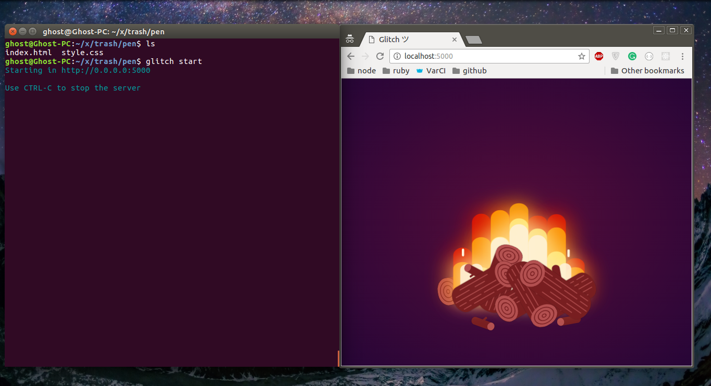

> **NOTE (2nd Oct 2017):** To avoid confusion with [Fog Creek's Glitch](https://glitch.com), I'm thinking of renaming the project to something else. Got a cool name? let me know.

Hi, everyone!

I'm excited to share with you the little project I've been working on the past couple of weeks in my free time in order to practice TypeScript/JavaScript/webpack. I call it **Glitch Playground**!

It's basically a simple, local playground for latest HTML/CSS/JavaScript. It's powered by [webpack](https://webpack.js.org) and [webpack-dev-server](https://github.com/webpack/webpack-dev-server). In addition to what webpack offers, the playground does the following:

- Automatic creation of webpack entries (no configuration required)
- Preconfigured loaders to transform your code (supports ES 6+, CSS Next)
- Ability to inject custom HTML code into the generated `index.html`

## How it works

Internally, the playground is just a set of [webpack](https://webpack.js.org) plugins/loaders. We use the same, good, official [webpack-dev-server](https://github.com/webpack/webpack-dev-server) to serve the final JavaScript bundle.

It works by walking through the current directory contents to determine suitable entry point files for webpack. An entry point file can be:

### 1. index.[ext]:

Used to customize the HTML output (it will be transpiled if necessary).

**Example:**

```HTML
<!-- index.html -->
<div id="root"></div>
```

### 2. app.[ext]:

Used as start point for your JavaScript (it will be transpiled if necessary) code, you should import all your scripts here.

**Example:**

```JavaScript
// app.js
console.log('Hello world');
```

### 3. style.[ext]:

Used as a start point for your stylesheets (it will be transpiled if necessary). You should import all your other styles here. Otherwise, you need import them in your `app.[ext]` as you would normally do when using webpack.

**Example:**

```CSS
/* style.css */
body {
  color: green;
}
```

You can think of these entry points as the HTML/CSS/JS tabs you would see in any online playground such as [Codepen](https://codepen.io), [JSFiddle](https://jsfiddle.net/).

**All these files are optional.**

### Extensions mapping

We use the file extensions as a source of truth in order to determine whether we need to perform transpilation or not.

| Extensions    | Loader                                                        | Notes                                               |
| :------------ | :------------------------------------------------------------ | :-------------------------------------------------- |
| **js,jsx,es** | [babel-loader](https://github.com/babel/babel-loader)         | Using `preset-env` and `preset-react`               |
| **html**      | [html-loader](https://github.com/webpack-contrib/html-loader) |                                                     |
| **css**       | [css-loader](https://github.com/webpack-contrib/css-loader)   | In addition to `postcss-cssnext` and `autoprefixer` |

## Installation

You need to have Node.js (v8.4.0 or later) and npm (v5.3 or later) installed.

```sh
$ npm install -g @glitchapp/cli
```

## Demo

So, now let's play try to run [this pen](https://codepen.io/short/pen/gGWbQB) by **@short** locally!

**1. Setup**

```bash
$ mkdir campfire
$ cd campfire

```

**2. Copy files**

```bash
$ # let's copy the HTML code
$ # .html,.css? yep, we don't support "Stylus" or "Pug" template yet!
$ curl -o index.html https://codepen.io/short/pen/gGWbQB.html
$ # and the CSS code too!
$ curl -o style.css https://codepen.io/short/pen/gGWbQB.css
```

**3. Run Glitch**

```bash
$ ls
index.html  style.css
$ glitch start
Starting in http://0.0.0.0:5000

Use CTRL-C to stop the server
```

Now open http://localhost:5000 in your browser, you should see the same output as the original [pen](https://codepen.io/short/pen/gGWbQB), something like:



## What next

The project is still in early stage, and there are a lot of possible improvements and some [known issues](https://github.com/z0al/minipack/issues). It was indented to be part of my [#100DaysOfCode](http://100daysofcode.com/) challenge, sadly, I failed to allocate at least 1 hour daily due to many reasons out of my control.

**Possible improvements**

1. Support for other languages e.g. TypeScript, SASS, Pug ..etc
2. Advance user HTML injection([#2](https://github.com/z0al/minipack/issues/2))
3. Browser sync support
4. Better error handling
5. General performance improvements
6. Share your glitch to something like Codepen!
7. Editor support?

## Acknowledgments

Inspired by the awesome work of Facebook in their [create-react-app](https://github.com/facebookincubator/create-react-app) package.

This project would not have been possible without these great projects:

- [Node.js](https://nodejs.org)
- [webpack](https://webpack.js.org)
- [webpack-dev-server](https://github.com/webpack/webpack-dev-server)

## Summary

The project is still in the beta stage if you find any issues or have any suggestions please feel free to [report them](https://github.com/z0al/minipack/issues/new). The source code is publically available on [GitHub](https://github.com/z0al/minipack), give it ⭐ if you like the project.

Also, this is my first time to write here (and the 3rd time ever), ping me if I made any mistake ;)
