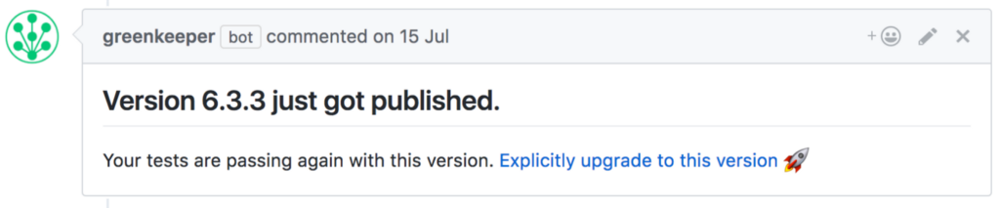
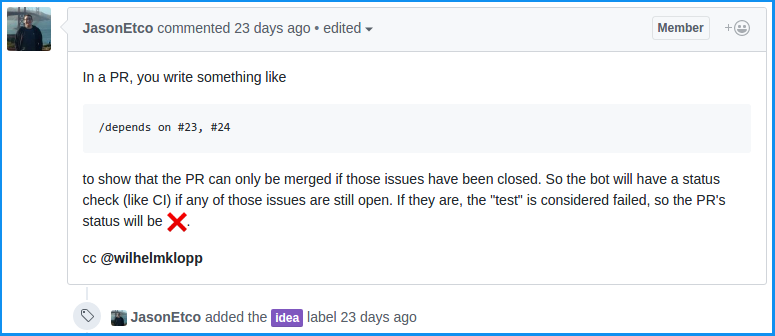
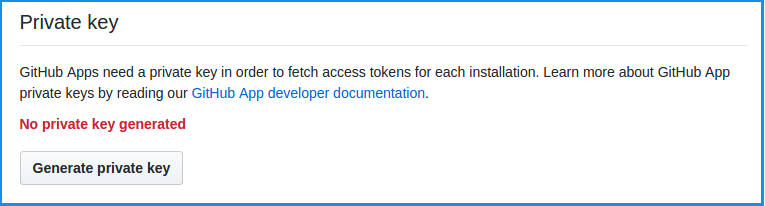
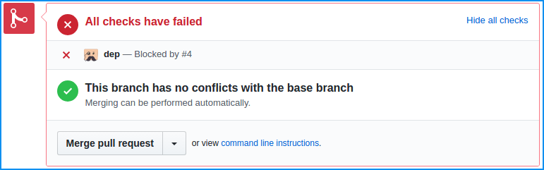

[GitHub Apps](https://developer.github.com/apps) (formerly Integrations) were [launched](https://developer.github.com/changes/2017-05-22-github-apps-production-ship) earlier this year. Apps are first-class citizen in GitHub which means they act on their own behalf, just like a normal GitHub user.

In GitHub.com you can visually distinguish apps (bots) from normal users by the “bot” suffix that GitHub adds after the app name. For example, this how [Greenkeeper](https://greenkeeper.io/)’s bot looks like:



GitHub lets the app subscribe to certain events (aka [webhooks](https://developer.github.com/webhooks)). When one of those events is triggered, it will send an HTTP POST payload to a pre-configured URL. A CI service, for example, will need to subscribe to “Push” events in order to run your tests whenever to push new code.

## About Probot

From the [official docs](http://probot.github.io/docs/):

> Probot is a framework for building [GitHub Apps](http://developer.github.com/apps) in [Node.js](https://nodejs.org/). It aims to eliminate all the drudgery–like receiving and validating webhooks, and doing authentication handstands–so you can focus on the features you want to build.

Probot lets you focus on your app functionality instead of having to mess around figuring out how to [correctly authenticate](https://developer.github.com/apps/building-integrations/setting-up-and-registering-github-apps/about-authentication-options-for-github-apps/) a request, validate a [webhook payload](https://developer.github.com/webhooks/#payloads) or simulate a [webhook request](https://probot.github.io/docs/simulating-webhooks/). It also comes pre-configured with [localtunnel](https://localtunnel.github.io/www/) to make your life easier 😍

Another good benefit of using Probot is the ability to use existing [extensions](https://github.com/probot) to provide nice features such as [Slack like commands](https://github.com/probot/commands).

Probot is written in [Node.js](http://nodejs.org) so prior familiarity with JavaScript and [npm](https://npmjs.com) is very helpful to understand the code snippets in this post.

For [API](https://developer.github.com/v3/) calls, Probot [injects](https://probot.github.io/docs/github-api/) an authenticated [GitHub API client](https://github.com/octokit/node-github) instance under context object. Take a look at this minimal example:

```javascript
module.exports = (robot) => {
	robot.on("issues.opened", async (context) => {
		// `context` extracts information from the event, which can be passed to
		// GitHub API calls. This will return:
		//   {owner: 'yourname', repo: 'yourrepo', number: 123, body: 'Hello World!}
		const params = context.issue({ body: "Hello World!" });

		// Post a comment on the issue
		return context.github.issues.createComment(params);
	});
};
```

## Our App (bot)

In this post, we will try to implement a bot that is similar to a typical CI services like Travis, Circle ..etc but instead of running a test suite, we will check whether a pull request dependencies are resolved or not. A dependency can be either an issue or another pull request. An issue is considered resolved when it has been closed, but a pull request is considered resolved if it has been merged or closed.

I got the bot idea from [Jason Etcovitch](https://twitter.com/JasonEtco) ([original issue](https://github.com/probot/ideas/issues/1)):



Here how it works:

- A user (with push access) writes a comment in an open pull request with the following pattern:

```
/depends on #1 , #2 and maybe #3 too
```

- Our app will then mark the mentioned issues as necessary dependencies for that PR. It also adds a label (i.e. “dependent”) indicating that PR has some dependencies need to be resolved first before it can be merged.
- When an issue has been resolved, our app will search for Pull Requests those have a label with text "dependent” . If we found matches, we will update their statuses accordingly.

So, let’s get started 😄

## App registration

Before we start, we need to register our app, to do so, Follow the official GitHub’s guide [here](https://developer.github.com/apps/building-integrations/setting-up-and-registering-github-apps/registering-github-apps/).

**Notes:**

- If you don’t know where your app would live yet, you may consider using the URL of the app repository (i.e. [ahmed-taj/dep](https://github.com/ahmed-taj/dep)) as “ **Homepage URL** ”
- For now, you can safely use “https://example.com” as **“Webhook URL”** we will fix this shortly!
- We will need the following **permissions** for our app to work:

1. **Commit Statuses (Read & Write):** just like a CI service, we need to update commits status to reflect whether all dependencies (issues or PRs) are resolved or not.
2. **Repository administration (Read-only)** and **Organization members (Read-only):** We will only allow users with “Push” access to update a Pull Request dependencies.
3. **Issues (Read-only)** and **Pull requests (Read & Write):** To enable us to read/write issue comments, and update PR labels.

- Also, based on the permissions above, we need to subscribe to **“Issue comment”** , **“Issues”** , and **“Pull request”**.

## Generating a private key

After the App is registered, we’ll need to generate a private key. To generate a private key, click the **“Generate private key”** button.



Save the private key file somewhere safe on your local machine.

> **Tip:** the [official docs](https://probot.github.io/docs/development/) say:
>
> “Download the private key and move it to your project’s directory.”
>
> **I don’t recommend** this, instead save the private key elsewhere and point to its location later (see “Starting the app” section below)

## Local setup

Probot has a handy CLI to scaffold a new Probot-based GitHub App called “[**create-probot-app**](https://github.com/probot/create-probot-app)” so let’s create our first bot :)

```bash
$ npx create-probot-app dep
```

> **Tip:** You need [npm](https://www.npmjs.com) (5 or later) installed for the above commands to work!

The above command will install create-probot-app and then scaffold a probot starter app under “dep” directory. The structure of the folder will look something like this:

```bash
$ cd dep && tree
.
├── docs
│ └── deploy.md
├── etc
├── node_modules
├── __tests__
│ └── index.test.js
├── .env.example
├── .gitignore
├── .travis.yml
├── app.json
├── CODE_OF_CONDUCT.md
├── CONTRIBUTING.md
├── index.js
├── LICENSE
├── package.json
├── package-lock.json
└── README.md

4 directories, 13 files
```

Cool! create-probot-app (CPA) didn’t just scaffold our code, but also tests, and other necessary repository files (i.e. Code of conduct, README ..etc).

At the time of writing, CPA installs/configures [**Jest testing framework**](http://facebook.github.io/jest) by default. Jest is cool but you can definitely write your tests in any JavaScript testing framework you prefer. For the purpose of this post, we will stick with the defaults.

> **Tip:** If you’re using Visual Studio Code, I recommend using [Jest VS Code](https://marketplace.visualstudio.com/items?itemName=Orta.vscode-jest) extension

## Starting the app

In order to run our app we need to simply run the following command:

```bash
$ npm start
```

Let’s try it:

```bash
$ npm start

> dep-bot@1.0.0 start /home/ahmed/projects/dep
> probot run ./index.js

Missing GitHub App ID.
Use --app flag or set APP_ID environment variable.

...
```

As you might have noticed Probot needs to know our App ID, Webhook secret (if any), and the app private key. We can pass those variables every time we run **“npm start”** But there is another — easier — way; **.env** file!

Let’s **rename** “.env.example” file to “.env” and modify its content to look similar to this:

```bash
# The ID of your GitHub App
APP_ID=<Your App ID>

WEBHOOK_SECRET=<Your webhook secret>

# NOTE: Shortcuts like ~ in UNIX-like system will not work!
# Use absolute path instead
PRIVATE_KEY_PATH=<path/to/your/app/private-key.pem>

# Uncomment this to get verbose logging
# LOG_LEVEL=trace # or `info` to show less

# Subdomain to use for localtunnel server. Defaults to your local username.
# SUBDOMAIN=
```

If we run the start command again it should output:

```bash
$ npm start

> dep-bot@1.0.0 start /home/ahmed/projects/dep
> probot run ./index.js

Yay, the app was loaded!
Listening on https://ahmed.localtunnel.me
```

If your output is similar to the above, great! **you are ready to go**. If not, please consider reading the instructions above again. Don’t hesitate to comment below if you can’t get it working.

The `Listening on ..` part will vary based on your local machine’s username, in my case, it’s “ahmed”.

[**Localtunnel**](https://localtunnel.github.io/www/) works by assigning your server a unique publicly accessible URL that will proxy all webhooks (or any) requests to your locally running Probot server. This is very great for development!

Remember when we set our webhook URL to “https://example.com” ? Now let’s [**change it**](https://github.com/settings/apps) to whatever you get after `Listening on ..` part (i.e. https://ahmed.localtunnel.mein this case).

## Part (1): Adding PR dependencies

A Probot extension is just a normal JavaScript function that receives the robot object as one of its parameters.

We will be utilizing an extension called “[Slash commands](https://github.com/probot/commands)” to parse and interpret `/depends` or `/ensure` comments. Also, we will be using another extension that enables us to store custom JSON formatted inside any issue body. Let’s start by installing the necessary extensions:

```bash
$ npm add probot-{commands,metadata}
```

Now, let’s modify our index.js to use the extension:

```javascript
// index.js
// Packages
const command = require("probot-commands");

// Ours
const ensure = require("./lib/ensure");

module.exports = (robot) => {
	// Ensures all dependencies are resolved before the PR can be merged
	//
	// Triggered when you write:
	//    /COMMAND arguments
	command(robot, "depends", ensure);
	command(robot, "ensure", ensure);
};
```

**How it works:**

- Whenever a comment is created in a repository that has our app installed, GitHub will send a webhook request to our app and pass necessary payload.
- probot-commands will parse the comment body to match or possible slash commands (i.e “ensure” or “depends”).
- If a match was found, probot-commands will call our ensure function and pass the command name and its arguments (as string)

Let’s write an initial implementation for ensure function to make sure everything is working properly:

```javascript
// lib/ensure.js
const ensure = async (context, command) => {
	console.log("Hi, it is ensure");
	console.log("my arguments are:", command.arguments);
};

module.exports = ensure;
```

To test our implementation we need to actually install our app. Visit https://github.com/apps/YOUR_APP_NAME and install the app in any repository of yours. After the app has been installed, start the server (by running npm start) and then write a comment in any issues/PRs of that repository with the following text:

```
/depends on #1 and #2 are resolved first
```

You will see the following output in the terminal:

```
Hi, it is ensure
my arguments are: #1 and #2 are resolved first
```

Great! it’s working!

It’s time for real implementation 😎

```javascript
// lib/ensure.js
// Packages
const metadata = require("probot-metadata");

const ensure = async (context, command) => {
	// 1. We only target PRs
	if (!context.payload.issue.pull_request) return;

	// 2. Match issue numbers
	const issues = (command.arguments.match(/#(\d+)(?=\s*)/g) || []).map(
		(i) => Number(i.slice(1)) // Removes '#' prefix
	);

	// 3. Set dependencies (override!)
	await metadata(context).set("dependencies", issues);

	// 4. Extract necessary info
	const info = {
		owner: context.payload.repository.owner.login,
		repo: context.payload.repository.name,
		number: context.payload.issue.number,
	};

	// 5. Add or remove marker
	return issues.length > 0
		? context.github.issues.addLabels({ ...info, labels: ["dependent"] })
		: context.github.issues.removeLabel({ ...info, name: "dependent" });
};

module.exports = ensure;
```

**How it works:**

- Technically in GitHub, PRs are just special issues. To make sure we are processing a PR (not a plain issue) we need to check if a `pull_request` key exists (we don’t care about its value).
- We take the argument parameter (passed by probot-commands extension) and search for [issue patterns](https://github.com/blog/957-introducing-issue-mentions) ( **#** followed by a sequence of digits).
- We will then strip the “ **#** ” prefix and store issue numbers as metadata for that PR.
- Finally, we add a label to this PR to make it easier for us to distinguish dependent PRs.

**Testing**

Let’s add some tests to verify that our code works correctly.

```javascript
// __tests__/ensure.test.js
// Packages
const metadata = require("probot-metadata");
const { createRobot } = require("probot");

// Ours
const app = require("../index");
const events = require("./events");

// Globals
let robot;
let github;

// Mock everything
beforeEach(() => {
	// Here we create a robot instance
	robot = createRobot();

	// Here we initialize the app on the robot instance
	app(robot);

	// Mock GitHub client
	github = {
		issues: {
			addLabels: jest.fn(),
			removeLabel: jest.fn(),
		},
	};

	// Passes the mocked out GitHub API into out robot instance
	robot.auth = () => Promise.resolve(github);
});

test("processing plain issue comments", async () => {
	await robot.receive(events.issue_comment_created);
	expect(github.issues.addLabels).not.toBeCalled();
});

test("adding metadata", async () => {
	await robot.receive(events.pr_comment_created);
	expect(metadata).toBeCalledWith(
		expect.objectContaining({ payload: expect.any(Object) })
	);
	expect(metadata().set).toBeCalledWith("dependencies", expect.any(Array));
});

test("adding the marker", async () => {
	await robot.receive(events.pr_comment_created);
	expect(github.issues.addLabels).toBeCalledWith(
		expect.objectContaining({
			owner: "user",
			repo: "test",
			number: 1,
			labels: expect.any(Array),
		})
	);
});

test("removing the marker", async () => {
	await robot.receive(events.pr_comment_created_remove);
	expect(github.issues.removeLabel).toBeCalled();
	expect(github.issues.addLabels).not.toBeCalled();
});
```

The tests above mock the GitHub API client, and inject static payloads using `robot.receive(...)` helper!

The payload samples are copied from real (past) webhook payloads. Read “[Simulating Webhooks](https://probot.github.io/docs/simulating-webhooks/)” documentation for more info.

Now if we run npm test command we should see the tests are passing:

```bash
$ npm test

> dep-bot@1.0.0 test /home/ahmed/projects/dep
> jest

PASS __tests__ /ensure.test.js
  ✓ processing plain issue comments (4ms)
  ✓ adding metadata (2ms)
  ✓ adding marker (1ms)
  ✓ removing marker

Test Suites: 1 passed, 1 total
Tests: 4 passed, 4 total
Snapshots: 0 total
Time: 0.829s, estimated 1s
Ran all test suites.
```

> **Tip:**
> The default — CPA generated — npm script runs [**standard**](https://standardjs.com) after Jest tests. To change this behavior change the “test” script in “package.json” file.
>
> In my case, I’ve [completely replaced](https://github.com/ahmed-taj/dep/blob/master/package.json) **standard** with [**prettier-standard**](https://github.com/sheerun/prettier-standard) package, but, it’s up to you!

## Part (2): Check PR status on updates

In this part, we will add the actual testing part; when all dependencies have been resolved we will report “success”, otherwise, we will report “failure” in addition to what issues cause the failure.

The first question we need to answer is: when do perform our tests (checking all dependencies are resolved)?

If we think of our app as a CI, then it’s clear that we need to recheck dependency states whenever a new PR has been opened, or someone pushed new commits to an already opened PR. That implies we need to listen to these events:

1. `pull_request.opened`
2. `pull_request.reopened`
3. `pull_request.synchronize`

But … don’t we need to recheck when an issue has been closed/reopened too? Exactly, because changing an issue state doesn’t fire any of the above events, so, it’s necessary to listen to these events too:

1. `issues.closed`
2. `issues.reopened`
3. `pull_request.closed`

Let’s start by registering the events to Probot:

```javascript
// index.js
const test = require("./lib/test");

module.exports = (robot) => {
	// ...
	robot.on("pull_request.opened", test);
	robot.on("pull_request.reopened", test);
	robot.on("pull_request.synchronize", test);
	// ...
};
```

And here is our handler code:

```javascript
// lib/test.js
// Packages
const metadata = require("probot-metadata");

// Ours
const check = require("./check");

const test = async (context) => {
	// Extract necessary objects
	const { github, payload } = context;
	const repo = payload.repository.name;
	const owner = payload.repository.owner.login;
	const { sha } = payload.pull_request.head;

	// Get dependencies list
	const deps = (await metadata(context).get("dependencies")) || [];

	// Preform checks on this PR
	return check(github, owner, repo, sha, deps);
};

module.exports = test;
```

And `check.js` :

```javascript
// lib/check.js
// Packages
const metadata = require("probot-metadata");

// Ours
const report = require("./report");

const check = async (github, owner, repo, sha, deps) => {
	// Tell GitHub we are working on it
	await report(github, owner, repo, sha, "pending");

	// Helpers
	let pass = true;
	let blockers = [];

	for (const number of deps) {
		// Get issue details
		const issue = await github.issues.get({ owner, repo, number });

		// The actual test
		if (issue.data.state === "open") {
			pass = false;
			blockers.push(number);
		}
	}

	// Update the state
	report(github, owner, repo, sha, pass ? "success" : "failure", blockers);
};

module.exports = check;
```

**How it works:**

- Before we start the testing process, we send a status update to GitHub saying we started processing that webhook request.
- Then we use metadata extension to retrieve the dependencies list stored in part one (if any).
- Lastly, we iterate over all stored issues and fetch their states. If all of them are closed we report “success”. Otherwise, we report “failure” and pass a list of blocker issues.

Now, if you start the server and tested our code, you should see something like this in a PR checks panel:



OK, let’s add support for automatic re-checking when a dependency has been updated.

```javascript
// index.js
const update = require("./lib/update");

module.exports = (robot) => {
	// ...
	robot.on("issues.closed", update);
	robot.on("issues.reopened", update);
	robot.on("pull_request.reopened", update);
	robot.on("pull_request.closed", update);
	// ...
};
```

Our update.js will reuse the same check function:

```javascript
// lib/update.js
// Packages
const metadata = require("probot-metadata");

// Ours
const check = require("./check");

const update = async (context) => {
	const { github, payload } = context;

	// Issue or Pull request?
	const self = payload.issue || payload.pull_request;

	// Extract necessary info
	const owner = payload.repository.owner.login;
	const repo = payload.repository.name;

	// Constants
	const labels = "dependent";
	const state = "open";
	const per_page = 100;

	// Get all open, dependent pull requests
	github.paginate(
		github.issues.getForRepo({ owner, repo, state, labels, per_page }),
		async (page) => {
			for (const issue of page.data) {
				// We only process PRs
				if (!issue.pull_request) continue;

				const { number } = issue;

				// Get full PR details
				const pr = (await github.pullRequests.get({ owner, repo, number }))
					.data;

				// Get dependencies list
				const deps = (await metadata(context, pr).get("dependencies")) || [];

				// Re-check if the original issue is a dependency of this PR
				if (deps.includes(self.number)) {
					await check(github, owner, repo, pr.head.sha, deps);
				}
			}
		}
	);
};

module.exports = update;
```

**How it works:**

- Whenever a dependency X has been either reopened or closed, we will search for open pull requests that have “dependent” label.
- Then we iterate over the result searching for a pull request that has X as a dependency.
- If we found matches, we will run check function on each one of them.

> **Tip:** I wrote some tests for all parts, but I’ve not posted them here to not make this post lengthy, I’ve provided a link for the full code (including test files) below.

### Part (3): Authorization

> With power comes responsibility — Unknown

You might have noticed that our app will always add/update dependencies even if the user who commented with `/depends on …` isn’t an owner (or member with push access) of the repository. This is bad!

To fix this, we simply need to check author permission before performing any action that modifies the original issue.

```javascript
// index.js
// Packages
const metadata = require("probot-metadata");

const ensure = async (context, command) => {
	// Check user permission first
	const { permission } = (
		await github.repos.reviewUserPermissionLevel({
			username,
			owner,
			repo,
		})
	).data;

	// Possible values are: admin, write, read, none
	if (!["admin", "write"].includes(permission)) return;
	// ...
};
```

### Part (4): Deploying to Now

In this part, I will show you how to deploy the app to [Zeit Now](https://now.sh). You can definitely it deploy somewhere else, depending on your requirements or preferences. It worth mentioning that the official documentation of Probot has a [dedicated section](http://probot.github.io/docs/deployment) for deployment to different providers.

> **Tip:** Don’t forget to change the “webhook URL” to point to your deployment instead of your localtunnel.

Deploying apps to Now is easy, but you need to correctly set your app private key as an environment variable. I took a while to figure how to do it. Thanks to Tom Vincent for [their help](https://twitter.com/tlvince/status/925661028435877890)

So, to add the necessary secrets to Now, you need to run the following commands:

```bash
$ now secret add DEP_BOT_APP_ID "YOUR_APP_ID"

$ now secret add DEP_BOT_WEBHOOK_SECRET "YOUR_SECRET"

$ now secret add DEP_BOT_PRIVATE_KEY "$(base64 < /path/to/private-key.pem)"
```

> **Note** : Sorry, Windows folks, I don’t know whether “base64” command exists or not in Windows!

Also, it’s helpful to add “[now.json](https://zeit.co/blog/now-json)” file with the following content:

```json
{
	"name": "dep",
	"alias": ["dep"],
	"type": "npm",
	"env": {
		"APP_ID": "@dep_bot_app_id",
		"NODE_ENV": "production",
		"PRIVATE_KEY": "@dep_bot_private_key",
		"WEBHOOK_SECRET": "@dep_bot_webhook_secret"
	},
	"engines": {
		"node": ">=8.8.0"
	}
}
```

> **Tip:** you may need to change the alias array to something else not taken.

We, also, need to add now-start to package.json’s scripts to decode the private key:

```json
{
	"scripts": {
		"now-start": "PRIVATE_KEY=$(echo $PRIVATE_KEY | base64 -d) npm start"
	}
}
```

Now we can simply run now inside our app directory to deploy the app 😎, feels so good, right?

To make it even better, you may need to configure Travis CI to deploy the app for you by modifying .travis.yml file (pre-generated by CPA earlier)

```yaml
# ...
# existing content generated by create-probot-app
# ...
deploy:
  script: scripts/deploy.sh
  provider: script
  skip_cleanup: true
  on:
    branch: master
```

scripts/deploy.sh:

```sh
#!/usr/bin/env bash
# Taken from https://github.com/tlvince/validate-commit-msg-bot/blob/master/scripts/deploy.sh
set -euo pipefail


now="npm run -s now -- --token=$NOW_TOKEN"
repo_name="${TRAVIS_REPO_SLUG##*/}"

$now --public
$now alias
$now rm --safe --yes "$repo_name"
```

### Where to go next?

- Read the official [documentation](https://probot.github.io/docs).
- Join Probot [Slack channel](https://probot-slackin.herokuapp.com/).
- If you need more examples, then you definitely need to check the Probot [Apps list.](https://probot.github.io/apps/)

The full source code is available on [Github](https://github.com/ahmed-taj/dep).

Special thanks to [Jason Etcovitch](https://twitter.com/JasonEtco) for taking the time to review the original blog post and provide awesome feedback!

Happy coding!

---
