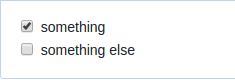

This is part 2 of a series of posts I'm planning to write while I'm building my open source side-project: **Submitter**. I'll be writing regularly(hopefully) about my work including all the challenges I came through.

**Previous post:** [Submission friendly projects: Introduction][part-1]

## The Format

The core idea behind the project is to make submitting issues/PRs easier by rendering their templates in an interactive way. Below, I'm going to describe the things that I think could be improved when we render the template, your thoughts are welcome!

> **NOTE:** The format should be compatible with GitHub Flavored Markdown [specification](https://github.github.com/gfm/).

#### Task Lists:

You can write task lists in GitHub like this:

```markdown
- [x] something
- [ ] something else
```

Or this:

```markdown
- [x] something
- [ ] something else
```

Or this:

```markdown
- [x] something
- [ ] something else
```

Or even as an ordered task list:

```markdown
1. [x] something
2. [ ] something else
```

> Technically, the ordered lists are rendered as `<ol>` in HTML, but GitHub's stylesheet removes the numbers.

All of the above lists will produce the same output (checkboxes):



While rendering task lists as checkboxes are cool, sometimes it makes more sense to use radio buttons to render task lists, e.g:

```markdown
I'm submitting:

- [ ] A bug
- [ ] A feature request
```

But we need to determine how to write radio button lists. I'd prefer to use `*` to indicate radio button lists and use `-`,`+`, and numbers to indicate normal task lists. e.g:

```markdown
- [ ] something
- [ ] something else
```

Will be rendered as:

```HTML
<input type="radio"> something </br>
<input type="radio"> something else </br>
```

> **NOTE:** because list item values may get so complex , we can't use dropdown (i.e. `<select>`) to render them as they may contain @mentions, #refs, [links]() ...etc.

However, I'll need a markdown parser that provides the info of what character used as unordered list indicator (i.e. `-` or `*`)? However, all parsers I know don't! For that reason, I may find myself in a situation either to write my own markdown parser or use a different approach for example, ordered task list?

#### Markdown inputs

Rendering the issue/PR template as HTML makes it necessary to provide a way to insert markdown input. We will use the following pattern:

```markdown
# Description

(description goes here)
```

For the above example we will render a `<textarea>` (that has markdown support) as follows:

```HTML
<h1>Description<h1>

<textarea placeholder="description goes here"></textarea>
```

Later when the user submits the form, we will parse the input in the `<textarea>` as markdown and inject it in the final markdown document.

Of course, you can't use markdown ..etc between `(` and `)`. If you want to tell the user something use normal markdown before the input pattern e.g:

```markdown
# Description

Read this [guide]() to know how to write a good description.

(description goes here)
```

#### Comments

Issue/PR template authors usually use HTML comments to guide you through the templates. But, because they're comments, they won't be visible when we render the template. A possible solution is to render them as `<blockquote>`s e.g:

```markdown
<!-- use x instead of y -->
```

Will be rendered to:

```HTML
<blockquote>use x instead of y</blockquote>
```

#### Show/hide sections

When using GitHub issues to report different types of issues i.e. bugs, feature requests, questions ..etc you may find there is type-specific information that isn't related to other types, for example, the version number isn't necessary for feature request issues.

In that case, a show/hide capability would be nice to have. However, I've no idea for now how to implement this feature, so I will ignore it for now and keep things simple. If you have an idea you'd like to share go ahead.

## The stack

I will be using the following technologies/products to implement the project, I never used some of them, so it's a good chance to learn:

- [Auth0](https://auth0.com) for authentication
- [Koa](koajs.com) for server-side logic
- [Next.js](https://github.com/zeit/next.js) for server-side rendered React
- [Now](now.sh) for hosting.
- And of course [GitHub](https://github.com)!

> **Edited:** The project source code is available in [ahmed-taj/submitter](https://github.com/ahmed-taj/submitter). It only contains initial setup right now!

More posts are coming!

Thank you :)

[part-1]: 
