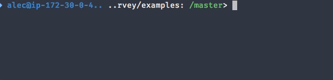
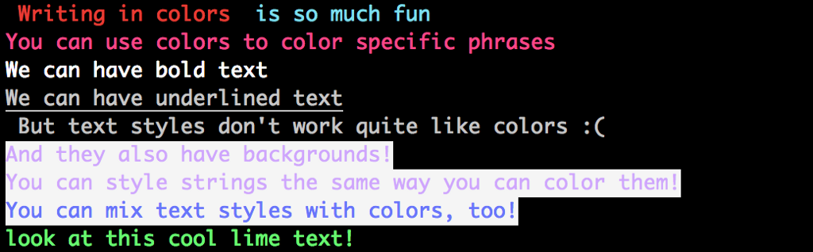

I recently [built my first](https://dev.to/ahmedtaj/local-to-dos-for-developers-5l2) Go language program ever 🙌. In this post I would like to share some Go packages I found very useful.

So without further ado let’s get started :)

## GoReleaser

Building and distributing binaries for several platforms can be challenging. GoRelaeser helps you to automate delivering your app binaries with ease. It can generate archived release files (i.e. binaries + LICENSE + README files), checksums, Homebrew taps, Docker images, [snap packages](http://snapcraft.io), release to GitHub (including the generating of customizable changelog 😃 ) and much more.

It works well with [Travis](http://travis-ci.org) and [CircleCI](https://circleci.com), so you can automate almost everything 👌

🔗 [http://github.com/goreleaser](http://github.com/goreleaser/)

## Cobra

Cobra is both a library for creating powerful modern CLI applications as well as a program to generate applications and command files. Cobra provides you everything you want to build awesome CLI, including sub-commands, automatic usage message, Pre and post run hooks, and generation of Man Page/Markdown/ResStructuredText docs.

Also, it provides automatic (without any configuration) suggestions when “unknown command” happens, e.g (yes, [Hugo](https://gohugo.io/) is powered by Cobra):

```bash
$ hugo srever
Error: unknown command "srever" for "hugo"

Did you mean this?
server

Run 'hugo --help' for usage.
```

🔗 [https://github.com/spf13/cobra](https://github.com/spf13/cobra)

## Survey

Do you love Node.js [inquirer package](https://www.npmjs.com/package/inquirer)? if yes, then you will probably love Survey too. While it doesn’t support yet all the features provided by [inquirer](https://www.npmjs.com/package/inquirer), it has all the basic features and very easy to usage.

<figcaption>Survey package in action</figcaption>

🔗 [https://github.com/AlecAivazis/survey](https://github.com/AlecAivazis/survey)

## Chalk

Again, if you are familiar with [npm](http://npmjs.org) packages like [chalk](https://www.npmjs.com/package/chalk), you will feel home here. Chalk is a go package for styling console/terminal output. like this:



🔗 [https://godoc.org/github.com/ttacon/chalk](https://godoc.org/github.com/ttacon/chalk)

## go-gitconfig

Probably is the smallest package of them all, but I find it really useful in git-related projects. It’s helpful when you want to extract some info from the global `~/.gitconfig` or the local `.git/config` files. Here is a portion of the code I used to extract origin URL value to fetch remote issues from GitHub:

```go
import (
    config "github.com/tcnksm/go-gitconfig"
)

remote := "origin"
url, err := config.Local(fmt.Sprintf("remote.%s.url", remote))

if err != nil {
    // .. print error
}
// use "url" value here to fetch from GitHub
```

🔗 [https://github.com/tcnksm/go-gitconfig](https://github.com/tcnksm/go-gitconfig)

## Other link(s)

1. [A curated list of awesome Go frameworks, libraries and software](https://github.com/avelino/awesome-go)
2. [List of useful(standard) go tools by @plutov](http://pliutau.com/go-tools-are-awesome/)
3. [My simple Git based To-Dos app written in Go](https://git.io/todos)

I hope you find this post useful. Thank you ;)
