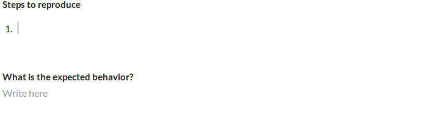

A few months ago I’ve started a tiny experiment I called **submitter**. The goal was to make it easier for people to open new issues on GitHub. You may need to read the [original post][part-1] to know the story in details.

Today I’m sad and happy to let you know that I’m deprecating the experiment in favor of GitHub’s new feature: [Multiple issue and pull request templates](https://github.com/blog/2495-multiple-issue-and-pull-request-templates). Sad to let go my baby experiment and happy to see the team behind GitHub trying to solve the problem.

While GitHub has taken a different approach, it’s still clear that the final project wouldn’t be as helpful as I first thought, so I think it makes sense to stop it now.

In this post, I will share the changes I made and the things I learned when working on my little experiment since the [last post][part-2].

#### Auth0 … too much

While [Auth0](http://auth0.com/) is very great and simple service, it’s just too much for such tiny thing as mine, I ended up using the old-good passport.js + GitHub.

#### YAML instead of Markdown

Markdown is easy to write but hard to read correctly by tools such as submitter, no yet. Yes, GitHub has a [spec](https://github.github.com/gfm/) for their implementation, but it’s not really stable yet, I personally encountered some spec errors while trying to make a GFM parser.

On the other hand, I think, [YAML](http://yaml.org/) is friendly to both humans and machines. So, here is how a simple submit.yml (would live inside the `.github` folder) would look like:

```yaml
meta:
  types:
    - Feature request
    - Bug report
  note: a text from maintainers

form:
  # Key: field name (rendered as label)
  # Value: a help text (rendered as input placeholder)
  Description: Write here

  # The value can also be an object
  Steps to reproduce:
    help: help text
    for: bug report

  What is the expected behavior?:
    for: bug report
```

The for attribute indicates that the field should be visible only when the specified type is selected. Types are defined by the meta.types list. A help text can be specified using the help sub-key or directly assigning a string as a value of a field. That’s it, really!

You can see a live preview of the result here: [https://submit.now.sh/to/z0al/test](https://submit.now.sh/to/z0al/test) (you need to login using GitHub)

#### Draft.js + Markdown = ❤️

For the form inputs, I used [Draft.js](http://draftjs.org/) with some other plugins to make writing Markdown text easier and fun, here is a demo:

<figcaption>How live Markdown editing works, Thanks to Draft.js</figcaption>

Of course when you submit the issue we will convert what you’ve written to pure markdown that GitHub understands, but this part isn’t fully functional yet e.g. for images.

> **NOTE:** If a lot of people would love to see a similar editor for GitHub as a browser plugin I would happily give it a shot!

If you’re curious how the final app would look like, it’s live at [https://submit.now.sh](https://submit.now.sh) (pre-alpha!! use at your own risk). The full source code is also available at [GitHub](https://github.com/z0al/submitter).

That’s all for now, thanks for reading!

---

[part-1]: 
[part-2]: 
